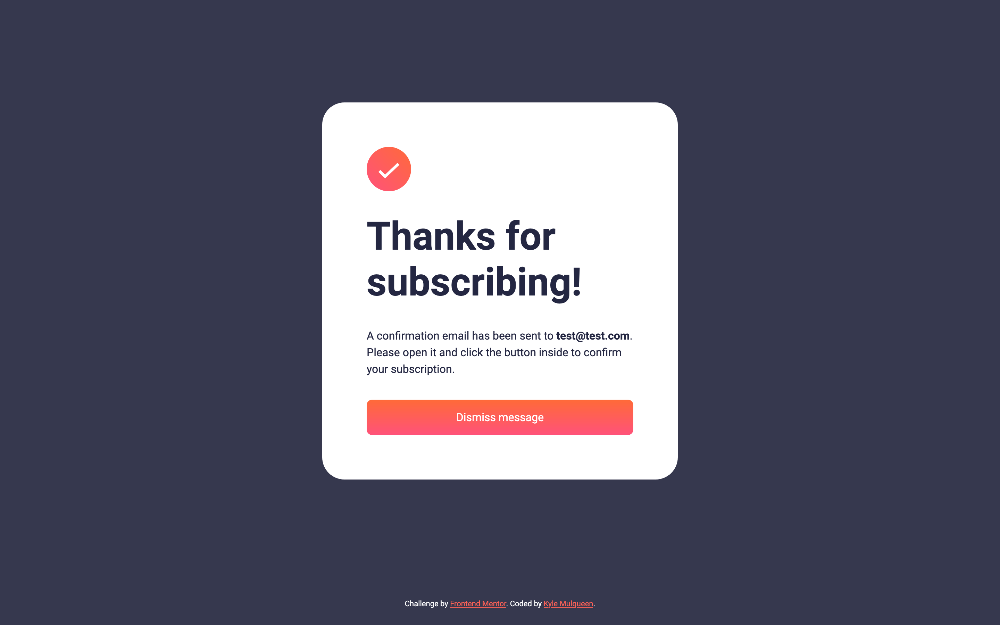

# Frontend Mentor - Newsletter sign-up form with success message solution

This is a solution to the [Newsletter sign-up form with success message challenge on Frontend Mentor](https://www.frontendmentor.io/challenges/newsletter-signup-form-with-success-message-3FC1AZbNrv). Frontend Mentor challenges help you improve your coding skills by building realistic projects.

## Table of contents

- [Frontend Mentor - Newsletter sign-up form with success message solution](#frontend-mentor---newsletter-sign-up-form-with-success-message-solution)
  - [Table of contents](#table-of-contents)
  - [Overview](#overview)
    - [The challenge](#the-challenge)
    - [Screenshot](#screenshot)
    - [Links](#links)
  - [My process](#my-process)
    - [Built with](#built-with)
    - [What I learned](#what-i-learned)
    - [Continued development](#continued-development)
    - [Useful resources](#useful-resources)
  - [Author](#author)

## Overview

### The challenge

Users should be able to:

- Add their email and submit the form
- See a success message with their email after successfully submitting the form
- See form validation messages if:
  - The field is left empty
  - The email address is not formatted correctly
- View the optimal layout for the interface depending on their device's screen size
- See hover and focus states for all interactive elements on the page

### Screenshot




### Links

- Solution URL: [GitHub Pages](https://kmulqueen.github.io/newsletter-form/)

## My process

### Built with

- Semantic HTML5 markup
- CSS custom properties
- Flexbox
- CSS Grid
- Mobile-first workflow
- JavaScript

### What I learned

I learned how to handle browser form validation while maintaining custom styling:

```html
<form class="signup__form" id="signup-form" novalidate>
  <!-- Form elements -->
</form>
```

```css
.signup__input:user-invalid {
  border-color: var(--clr-red-400);
  color: var(--clr-red-400);
  background-color: var(--clr-red-100);
}
```

```js
// Prevent the constraint validation API message bubble from appearing
formInputBox.addEventListener(
  "invalid",
  (e) => {
    e.preventDefault();
  },
  true
);
```

The key insight was preventing default behavior on the `invalid` event to suppress browser validation messages while still leveraging `:user-invalid` CSS selectors.

### Continued development

In future projects, I want to focus on:

- Creating more accessible form validation patterns with proper ARIA attributes
- Writing more descriptive function names that accurately reflect their purpose
- Implementing more robust validation strategies with appropriate user feedback
- Exploring the Constraint Validation API in more depth

### Useful resources

- [MDN Web Docs: Client-side form validation](https://developer.mozilla.org/en-US/docs/Learn/Forms/Form_validation) - Comprehensive guide to form validation techniques.
- [MDN Web Docs: Constraint Validation API](https://developer.mozilla.org/en-US/docs/Web/API/Constraint_validation) - Detailed explanation of the browser's built-in validation features.
- [CSS-Tricks: Form Validation UX in HTML and CSS](https://css-tricks.com/form-validation-ux-html-css/) - Helpful techniques for creating user-friendly validation experiences.

## Author

- Website - [Kyle Mulqueen](https://kmulqueen.github.io/portfolio-2025/)
- Frontend Mentor - [@kmulqueen](https://www.frontendmentor.io/profile/kmulqueen)
